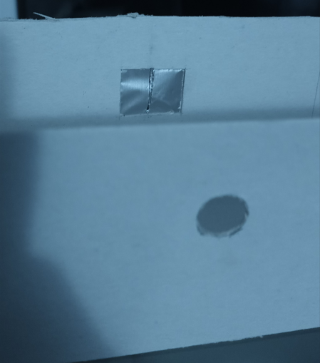
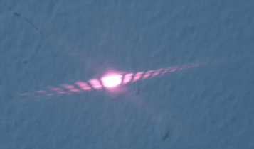
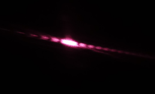

# Experimento de doble rendija
 
## Descripción del experimento
 
 El experimento de doble rendija es un clásico experimento de la física cuántica que se utiliza para ilustrar los conceptos de la superposición cuántica. En este experimento, un haz de partículas (como electrones o fotones) se dirige hacia una barrera con dos rendijas paralelas, detrás de las cuales hay una superficie para observar.

 En el experimento de doble rendija, se observa un patrón de interferencia en la pantalla, similar al que se produce cuando se hace pasar una onda a través de dos rendijas. La explicación de este patrón de interferencia se encuentra en que las partículas no tienen una posición precisa antes de ser medidas, sino que existen en un estado de superposición, en el que tienen la posibilidad de estar en varias posiciones simultáneamente.

 En el caso del experimento de doble rendija, las partículas se encuentran en un estado de superposición que las hace pasar por ambas rendijas al mismo tiempo. Luego, estas dos trayectorias posibles se combinan en la pantalla detectora, produciendo un patrón de interferencia.

 # Materiales
 
* Carton paja.
* Bisturí.
* Papel aluminio.
* Regla.
* Puntero laser.

# Construcción
Para la elaboración del experimento se necesita de unos cortes paralelos precisos, estos se hacen de forma paralela para que los fotones del haz luz pase por ambos cortes, así dando como resultado el particular patrón mencionado anteriormente.

Para estos cortes se uso papel aluminio ya que las propiedades de este material nos dan una precisión mejor que la de una hoja de papel;  Para hacer el corte se usó un bisturí, dichos cortes tienen que estar uno muy cerca del otro, esto para que el haz de luz logre entrar por las dos rendijas al mismo tiempo. Hecho el corte se procede hacer la maqueta, donde la estructura en la que el puntero laser se apoyara tiene que estar apuntado directamente a las dos rendijas.

En este caso en particular se decidió por hacer un montaje simple, debido a la facilidad de que las rendijas se estropeen al mover el montaje. 
Se recomienda que la distancia de separación entre las salidas de las rendijas y la superficie en la que se ve el experimento sea considerable, esto para ver de manera más clara el patrón.

# Resultados 

Tras haber montado el experimento se pudo observar el patrón del experimento de doble rendija , como se evidencia en las siguientes imágenes.

#### Resultado con la luz encendida

#### Resultado con la luz apagada

[Videos del experimento](https://www.youtube.com/shorts/pLxS8AJ6dJM)
